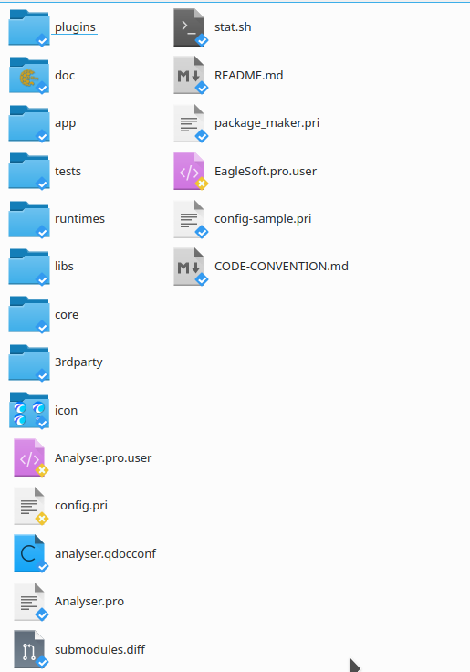
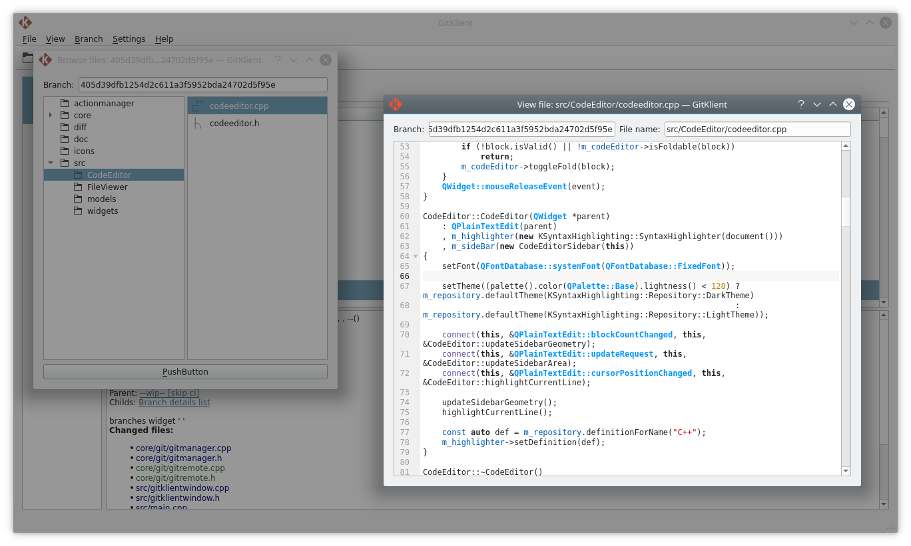
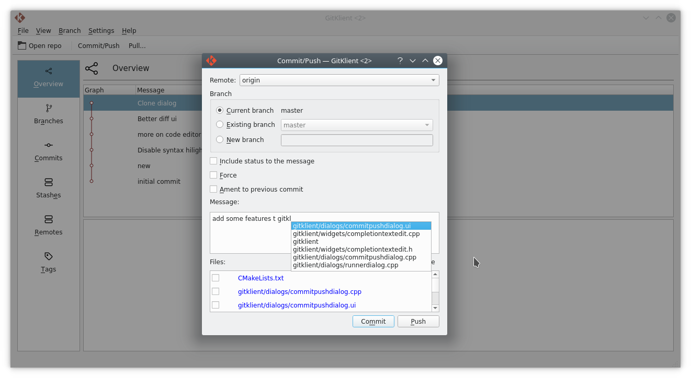
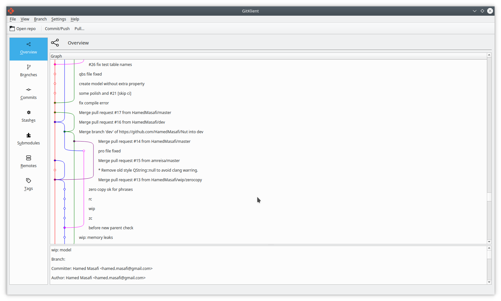
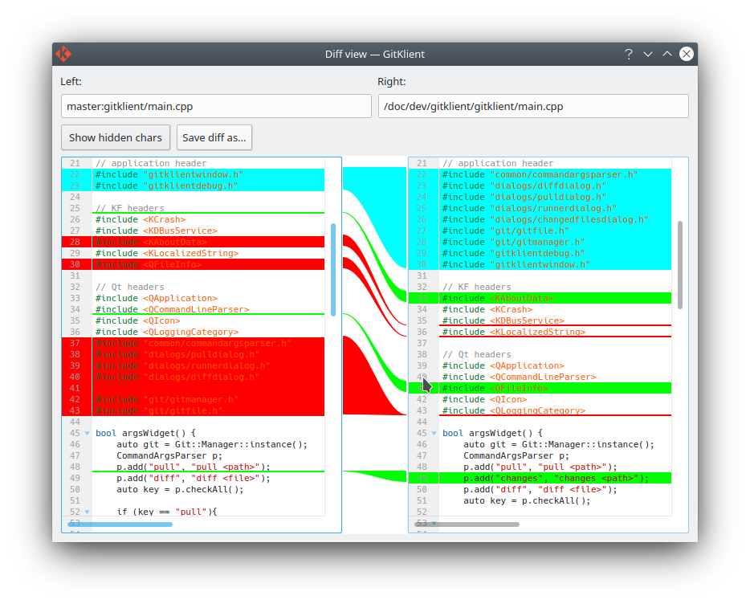
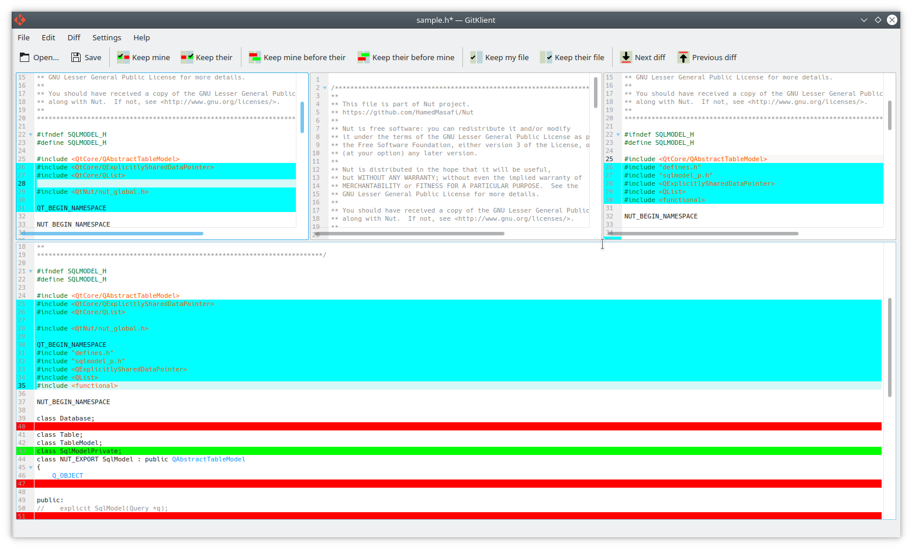

[](https://invent.kde.org/sdk/kommit/-/pipelines)

# Kommit

Git gui client for KDE

## Build

Install Qt via online installer or your distro's package manager
```
sudo apt install qt6-qmake qt6-qmake-bin libqt6core6a libqt6gui6 libqt6concurrent6
```

Install required packages
```
sudo apt install libkf6config-dev libkf6configwidgets6 libkf6configwidgets-dev libkf6coreaddons-dev libkf6crash-dev libkf6dbusaddons-dev libkf6doctools-dev libkf6i18n-dev libkf6xmlgui-dev libkf6kio-dev libkf6kiocore6 libkf6kiogui6 libkf6kiowidgets6 libkf6textwidgets-dev libkf6texteditor-dev cmake make extra-cmake-modules gettext libkf6syntaxhighlighting-dev libkf6syntaxhighlighting-data libkf6syntaxhighlighting-tools libgit2-dev
```

Navigate to source dir and do these steps
```
mkdir build
cd build
cmake ..
make -j 8
make install
```

## TODO list
  - Rebase support
  - Make a new visual graph for doing merge or rebase 
  - Finalize merge tool (some ui improvement needed)
  - Authors view
  - Show file history in differential view (like wikipedia)
  - Reports (including chart and data)
    - Commits per authors
    - Commits per weekday and month day
    - Projects lines count per each author
  - Custom actions support (e.g. clang-format)

## Features

<details>
    <summary>Show overlay icons on files in the Dolphin file manager</summary>
    
</details>

<details>
    <summary>Browse files in another branch or commit and view files content </summary>
    
</details>
<details>
    <summary>Autocomplete on writing commit messages</summary>
    
</details>
<details>
    <summary>Graph view for commits and merges</summary>
    
</details>
<details>
    <summary>Show changes on visual way</summary>
    
</details>
<details>
    <summary>See differences and conflicts and resolve them by visual tool</summary>
    
</details>

